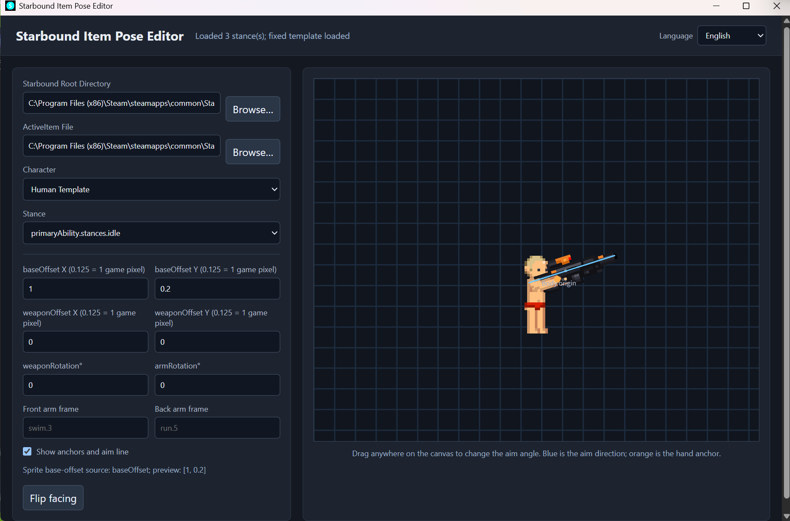

# Starbound Item Pose Editor

An early Windows utility for previewing Starbound ActiveItem holding poses and quickly tuning offsets outside the game. It reads game and mod resources without modifying `assets.pak`; all parameter changes are preview-only for now and are never written back to an `.activeitem` file.



I built this small tool with Codex to avoid repeatedly launching the game just to test an item's offset. The project is still in an early stage, and I may add more features and rendering compatibility as my own needs evolve.

## Usage

`StarboundItemPoseEditor.exe` is included in the project root. Place the full folder inside your Starbound installation to let the app discover resources automatically, or choose the Starbound root directory in the interface after moving it elsewhere. Double-click the EXE to run it—Rust, Node.js, and a local build are not required.

The current preview supports fixed-template and random-template guns, arm aiming, left/right facing, base race templates, and mod ActiveItem files containing comments or raw newlines inside strings.

## Development Build

Install Rust with the MSVC toolchain, Node.js 20+, and the **Desktop development with C++** workload from Visual Studio 2022 Build Tools. Then run the following in this directory:

```powershell
npm install
npm run build
```
